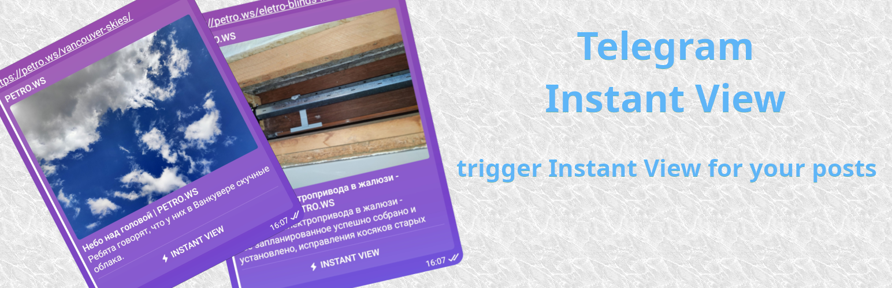
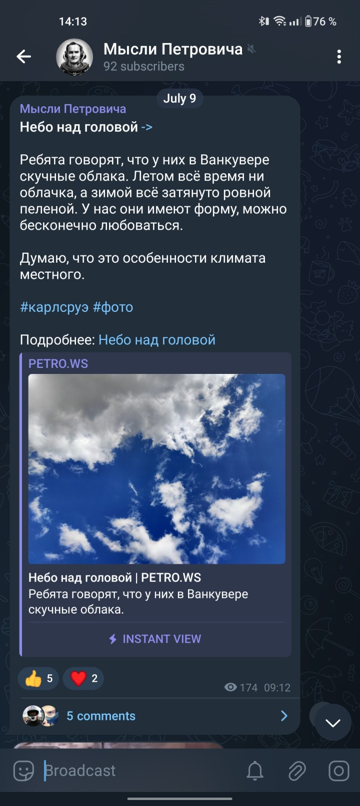
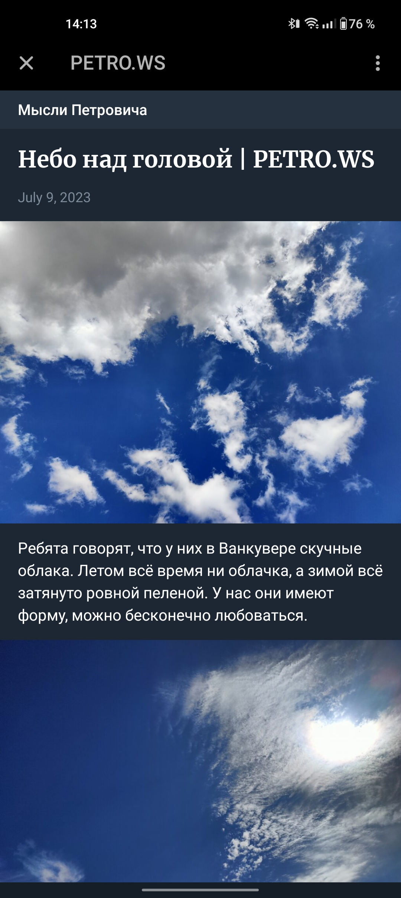
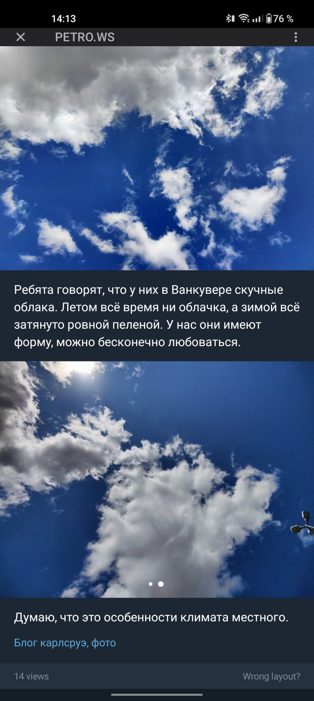
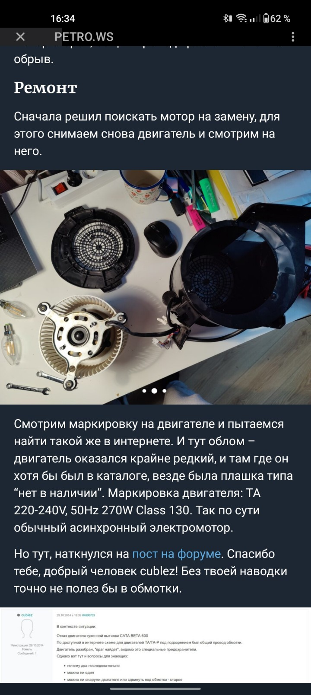

# Wordpress Telegram Instant View plugin

Wordpress plugin to trigger [Telegram Instant View](https://instantview.telegram.org/) for all Blog posts.

Principal: it detects Telegram bot and returns special template for
posts, to trigger Instant View.

* No template submitting required.
* No special links required.
* Compatable with any cross-posting systems.

Original Telegram InstantView templates registry appears to be dead,
my template was not reviewed and submitted in over 1 year. This plugin
solves this issue server-side.

Plugin was verified by WP team and published in Plugin Registry: https://wordpress.org/plugins/tg-instantview

Thanks a lot [@fishchev for template](https://gist.github.com/fishchev/ed2ca15d5ffd9594d41498a4bf9ba12e).

My Telegram channel with plugin active: https://t.me/petro_ws

## Installation

* Install plugin from [Wordpress plugin registry](https://wordpress.org/plugins/tg-instantview).
* Or, download package from Releases page and install it via Wordpress Plugin Manager.
* Or, manually: copy the `tg-instantview` into your `wp-content/plugins` directory.
* Check plugin configuration in "Settings" -> "TG InstantView settings", you may configure your channel ID (appears in IV header).

## Notes

* To test, how your posts appears for Telegram bot, just add `tg-instantview=1` parameter to post URL, [Post example](https://petro.ws/vancouver-skies/?tg-instantview=1).
* Telegram bot **caches** parsing result, and Instant View will be triggered for **new** URL's for bot. You may prune cache by adding some random parameters like `test=123`, Telegram bot will request again.
* Instant View works only on mobile cliens! Do not try to test it desktop clients.

## Screenshots

    
